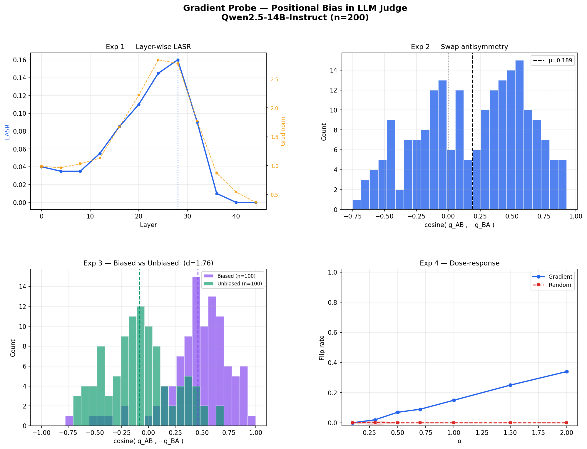
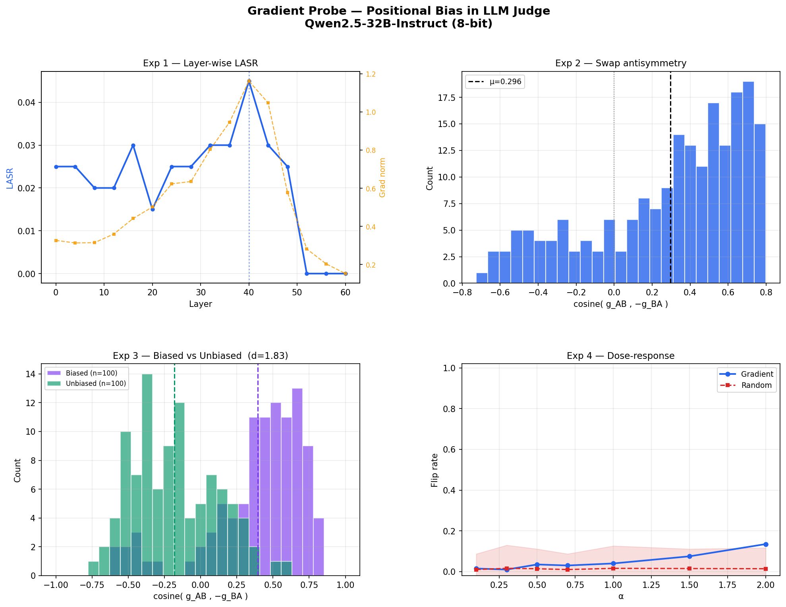
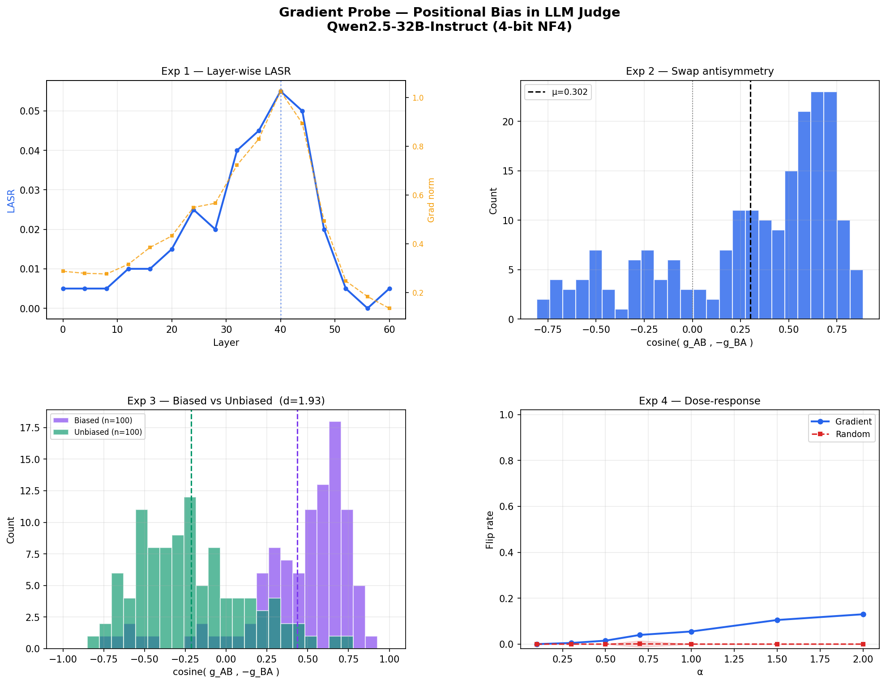

# Gradient-Based Probing for Positional Bias in LLM Judges

## Motivation

Previous work using linear probes (diff_mean, PCA on contrastive differences) to find positional bias directions in LLM judge activations showed only weak causal attribution (+0.017 flip-rate difference over random baseline). The root cause: probing via random noise in a ~3072-dim space means <0.15% of perturbation energy lands in the 3-dim bias subspace — the model never actually experiences a meaningful push along the bias direction.

This document proposes a gradient-based alternative, adapting the activation steering methodology from [\[TODO: cite paper\]](https://arxiv.org/html/2506.16078v1) to the positional bias setting.

---

## Core Idea: Gradient as Causal Probe

Instead of finding a bias direction statistically (mean difference between conditions), we find it causally — by asking the model's own computation graph where it is sensitive.

For each evaluation prompt where the model picks response A (first position):

```
g_l = ∇_{h_l} NLL(verdict=B)
```

`g_l` is the direction in activation space at layer `l` that, if moved along, would most directly increase the probability of verdict B. This is the causally relevant direction for verdict switching — by construction.

**Key advantage over diff_mean**: diff_mean finds where activations *statistically differ* between conditions. The gradient finds where activations *causally drive* the output. These are not the same thing.
---

## Experiment 1: Layer-Wise Sensitivity Profile (LASR-style)

Run the gradient-based perturbation at every layer and record how much the verdict moves.

**Procedure**:
1. For each prompt, for each layer `l`:
   - Forward pass → capture `h_l`
   - Backward pass → compute `g_l = ∇_{h_l} NLL(B)`
   - Perturb: `h_l' = h_l - α · g_l / ||g_l||`  (subtract — moves *against* the gradient, toward B)
   - Complete forward pass from layer `l` onward → record ΔNLL(B) and verdict change
2. Average ΔNLL across prompts per layer → **layer-wise sensitivity curve**

`g_l = ∇_{h_l} NLL(B)` points in the direction that decreases the negative log-likelihood of B, making verdict B more likely. We only do this procedure on positionally biased pairs, where the model wants to choose A despite A being wrong. So we perturb the activations towards verdict B and then record how much it moves.

**Scoring**: LASR, PASR, and MASR are computed only over pairs where `verdict_orig = "A"` (slot_1-biased pairs), since steering toward "B" is meaningless for pairs where the model already picks "B". A flip from "A" to either "B" or "C" counts as a success — both indicate the model is no longer locked onto slot_1.

- **LASR(l)** = fraction of slot_1-biased pairs that flip at layer l  
- **PASR** = max LASR across all layers (most vulnerable layer)  
- **MASR** = fraction of slot_1-biased pairs that flip at *any* layer (overall vulnerability)

**Normalization**: We tested the LatentSafety normalization scheme (δ' = μ(h) + (δ − μ(δ))/σ(δ) · σ(h)) which rescales the perturbation to match the hidden state distribution. Empirically this slightly *hurts* LASR — see Run 4.

**Expected shapes and interpretations**:

| Shape | Interpretation |
|---|---|
| Sharp mid-layer peak (~15–22) | Bias encoded in a bottleneck; one intervention point; correctable |
| Late-layer peak (~25–31) | Correct content representation, position overrides at decision stage |
| Flat / distributed | Bias is structural across all layers; no clean intervention point |

---

## Experiment 2: Swap Antisymmetry — Is the Gradient a Pure Position Signal?

This is the key experiment to establish whether the gradient captures **position** or **content**.

**Setup**: For paired prompts (A,B) and their swap (B,A) with the same underlying responses:

- On (A,B) prompt: compute `g_AB = ∇_h NLL(B)` — gradient steering toward the second response
- On (B,A) prompt: compute `g_BA = ∇_h NLL(A)` — gradient steering toward the second response (now A)

**Measure**: `cosine(g_AB, -g_BA)` at the peak-sensitivity layer.

| Value | Interpretation |
|---|---|
| ≈ +1.0 | Positionally biased: model avoids slot_2 in both orderings → both gradients large, opposite content directions |
| ≈ 0.0 | Content-driven (unbiased): model already picks slot_2 in one ordering → one gradient near-zero → cosine noisy |
| ≈ −1.0 | Strongly unbiased: model confidently picks slot_2 in both orderings → both gradients small but correlated |

---

## Experiment 3: Antisymmetry as a Classifier for Positional Bias

**This is the novel contribution**: use the swap antisymmetry score itself as a *detector* of whether a given pair exhibits positional bias.

**Theory**:

The metric is driven by **gradient magnitude**, not directional geometry. The key question is whether the model is already predicting the slot-2 token in each ordering.

- **Positionally biased pairs** (model picks slot_1 in *both* orderings): `cosine(g_AB, -g_BA) ≈ +1.0`
  The model confidently avoids slot_2 in both AB and BA orderings, so NLL(slot_2 target) is high in both → both g_AB and g_BA are large. They happen to point in *opposite* content directions (slot_2 in AB contains resp_b; slot_2 in BA contains resp_a), so cosine(g_AB, g_BA) ≈ −1 → cosine(g_AB, −g_BA) ≈ **+1**.

- **Non-positionally-biased pairs** (model judgment tracks content): `cosine(g_AB, -g_BA) ≈ 0.0` or negative
  The model consistently picks the better response regardless of slot. In one of the two orderings, the better response happens to be in slot_2, so the model *already* predicts slot_2 → NLL(slot_2 target) is low in that ordering → one gradient is near-zero and noise-dominated → cosine collapses toward 0 (or slightly negative due to the local gradient geometry).

**Implication**: A pair where the model's verdict is positionally biased should show a *higher* antisymmetry score than a pair where the model judges correctly. We can operationalize this:

1. Label pairs as positionally biased using the swap test (model picks A on (A,B) but picks A on (B,A) too → biased toward A regardless)
2. Compute antisymmetry scores for biased vs. unbiased pairs
3. Test whether antisymmetry is a reliable signal → receiver operating characteristic (ROC) for positional bias detection

If this holds, the gradient antisymmetry score is a **probe-free, input-agnostic detector** of positional bias at the activation level.

---

## Experiment 4: Causal Intervention — Dose-Response

At the peak-sensitivity layer, vary the perturbation scale `α` and measure:

- `P(verdict flips A→B | steer along g_AB)` vs. `α`  
- `P(verdict flips A→B | steer along random direction)` vs. `α` (baseline)
- ΔNLL(B) vs. `α`

**Expected result if gradient captures causal position mechanism**:
```
flip rate
    |         gradient direction
    |        ___________
    |       /
    |______/              _____ random baseline (flat)
    0    0.1   0.5   1.0   α
```

A steep, smooth dose-response curve along the gradient direction that is absent for random directions establishes that the gradient is finding a causally specific — not merely energetically large — direction.

**Interpretive question for the flip**: does the post-intervention verdict reflect corrected quality judgment, or just reversed positional bias? Disambiguate using human-annotated ground-truth preference labels:
- If post-intervention verdict matches human preference more often → intervention corrected the bias
- If post-intervention verdict just tracks "whichever was second" → bias reversed, not corrected

---

## Experiment 5: Comparing Posttrained Models (NOT DOING ATM!)

Run the full pipeline (layer sensitivity, antisymmetry, dose-response) across models that differ in posttraining:

- Base model (no RLHF/instruction tuning)
- Instruction-tuned (SFT only)
- RLHF-trained / preference-optimized

**Hypothesis**: Posttraining sharpens the position bias signal — the gradient becomes more concentrated at a specific layer and the antisymmetry score becomes more pronounced — because preference optimization reinforces whatever heuristics the model uses to produce consistent verdicts, including positional ones.

Concretely, we'd expect:
- Base model: flat layer-sensitivity curve, low antisymmetry
- RLHF model: peaked layer-sensitivity curve, high antisymmetry on unbiased pairs

This would provide mechanistic evidence that **RLHF amplifies positional bias** as a side effect of training for verdict consistency. (Coralie annotation: wrong. We'd expect that even if positional bias is still encoded in latent representations, the model is less sensitive to perturbations and also less likely to get into "toxic" positional bias subspace. Depending on how a model is finetuned, these latent representations of postional bias might not exist at all. If they do exist, we expect they are sitll perturbationally sensitive)

---

## Summary of Metrics

| Metric | What it measures |
|---|---|
| Layer-wise ΔNLL | Where in the model positional bias is causally encoded |
| `cosine(g_AB, -g_BA)` | Whether the gradient captures position vs. content |
| ROC(antisymmetry → bias label) | Whether antisymmetry detects positionally biased pairs |
| Dose-response slope | Causal specificity of the gradient direction |
| Post-intervention accuracy vs. human labels | Whether intervention corrects or reverses bias |
| Cross-model antisymmetry comparison | Whether posttraining amplifies positional bias |

---

## Why This Is Better Than What We Had

| Issue with previous approach | How gradient probing fixes it |
|---|---|
| 3 bias directions in 3072-dim space → <0.15% noise energy in bias subspace | Gradient moves exactly along the causally relevant direction; no dimensionality dilution |
| diff_mean is correlational (statistical fingerprint) | Gradient is causal (defined by the computation graph) |
| Binary flip rate is low-sensitivity | ΔNLL is continuous; detects signal before verdict crosses threshold |
| Fixed layer (layer 20) | Layer sweep finds the actual locus of position encoding |
| No way to distinguish "position" from "content" directions | Swap antisymmetry cleanly separates the two |


# Run results

## Run 1: Qwen-14B in 4bit quantization

**Model**: Qwen/Qwen2.5-14B-Instruct, 4-bit quantization (bitsandbytes), n=200 pairs (50% biased / 50% unbiased), HelpSteer2 validation set.

**Results directory**: `results/latent_perturbations/gradient_probe_14b_v2_2074118/`



### Exp 1 — Layer-wise LASR

N_A = 143 (pairs with verdict_orig = "A").

| Metric | Value |
|---|---|
| Peak layer | **28 / 48** (58% depth) |
| PASR | **0.140** |
| MASR | **0.154** (22 pairs flipped at ≥1 layer) |

Gradient norm peaks at layers 24–28 (~2.8) and drops sharply to near-zero at layers 40–44. The bell-shaped LASR curve is consistent with a localised positional bias representation — a single intervention point rather than a diffuse structural effect. MASR > PASR (0.154 vs 0.140) means 2 pairs are only flippable at off-peak layers.

(Coralie notes: the way I understand this is peak sensitivity is at a later layer, meaning when cont)

### Exp 2 — Swap Antisymmetry

At layer 28: cosine(g_AB, −g_BA) mean = **0.189** (std = 0.412, median = 0.261). 25.5% of pairs score above 0.5; only 5% above 0.8. The broad distribution and moderate mean are expected for a mixed (50/50 biased/unbiased) pool — biased and unbiased pairs pull the distribution in opposite directions.

(Coralie notes: should have used a purely biased pool here, am correcting this on the next run. THen the signal will probably be much stronger)

### Exp 3 — Classifier: Biased vs Unbiased

| | Biased (n=100) | Unbiased (n=100) |
|---|---|---|
| cosine mean | 0.461 | −0.083 |
| cosine std | 0.306 | 0.313 |

Gap = 0.544, **Cohen's d = 1.76**. The antisymmetry score cleanly separates positionally biased from unbiased pairs — strong enough to use as a per-pair detector. The biased-pair mean of 0.46 (not 1.0) reflects that the judgment is a mixture of position and content even in behaviorally biased pairs, and that 4-bit quantisation adds gradient noise.

Coralies note: on the left graph, see how disparate the two distributions are (kind of haha). The cosine can range from (1.0-> 0.0), and for the biased pairs, we'd ideally want 1.0. Am retrying with 8bit quantization, lets see whether that helps. Also for models which are more strongly positionally biased (Qwen isn't really very), this signal might be much stronger - might be worth retrying with Apertus or so 

### Exp 4 — Dose-Response

| α | Gradient flip rate | Random flip rate |
|---|---|---|
| 0.1 | 0% | 0% |
| 0.3 | 2% | 0.1% |
| 0.5 | 7% | 0% |
| 0.7 | 9% | 0% |
| 1.0 | 15% | 0% |
| 1.5 | 25% | 0% |
| 2.0 | 34% | 0% |

Gradient flip rate increases monotonically with α; random baseline is flat at ~0% across all scales. The gradient direction is causally specific, not just energetically large.

Coralie note: should rename these graphs haha

### Takeaway

Positional bias is causally encoded at a specific location (layer 28) in Qwen2.5-14B. The gradient antisymmetry score works as a bias detector (d=1.76). The moderate absolute LASR (34% at α=2.0) and biased-pair cosine (0.46) suggest the signal would strengthen with less quantisation noise — motivating the next run in 8-bit or bf16.

---

## Run 2: Qwen-32B in 8-bit quantization

**Model**: Qwen/Qwen2.5-32B-Instruct, 8-bit LLM.int8() (bitsandbytes), n=200 pairs, HelpSteer2 validation set.
**Dataset**: Exp 1/2/4 = all-biased pairs; Exp 3 = 50/50 biased/unbiased.

**Results directory**: `results/latent_perturbations/gradient_probe_32b_8bit/`



### Exp 1 — Layer-wise LASR

N_A = 146 (pairs with verdict_orig = "A").

| Metric | Value |
|---|---|
| Peak layer | **40 / 64** (63% depth) |
| PASR | **0.055** |
| MASR | **0.075** (11 pairs flipped at ≥1 layer) |

The curve is almost flat across all layers (0.015–0.055) — a stark contrast to the 14B bell curve. Gradient norm increases monotonically to layer 40 then drops. MASR > PASR (0.075 vs 0.055) — 5 pairs flip only at off-peak layers, possibly due to 8-bit gradient noise spreading signal across layers.

### Exp 2 — Swap Antisymmetry

At layer 40: cosine mean = **0.296** (std = 0.399, median = 0.394). 40.5% of pairs above 0.5. Dataset is all-biased (not comparable to Run 1's 50/50 pool).

### Exp 3 — Classifier: Biased vs Unbiased

| | Biased (n=100) | Unbiased (n=100) |
|---|---|---|
| cosine mean | 0.395 | −0.181 |
| cosine std | 0.338 | 0.289 |

Gap = 0.576, **Cohen's d = 1.83**. Separation improved over 14B despite lower LASR — the gradient direction is a better classifier even though the model is harder to steer.

### Exp 4 — Dose-Response

Not completed (job cancelled at time limit before alpha loop ran).

### Takeaway

8-bit LLM.int8() internally casts bfloat16 → float16 for outlier features, adding unexpected gradient noise. Despite this, the classifier improved (d=1.83 vs 1.76). LASR dropped sharply — likely a genuine model-size robustness effect, but 8-bit noise may also contribute. Motivates a 32B run with 4-bit NF4 (same quantisation as Run 1) to isolate model size from quantisation method.

---

## Run 3: Qwen-32B in 4-bit NF4 quantization

**Model**: Qwen/Qwen2.5-32B-Instruct, 4-bit NF4 (bitsandbytes), n=200 pairs, HelpSteer2 validation set.
**Dataset**: Exp 1/2/4 = all-biased pairs; Exp 3 = 50/50 biased/unbiased.

**Results directory**: `results/latent_perturbations/gradient_probe_32b_4bit/`



### Exp 1 — Layer-wise LASR

N_A = 151 (pairs with verdict_orig = "A").

| Metric | Value |
|---|---|
| Peak layer | **40 / 64** (63% depth) |
| PASR | **0.066** |
| MASR | **0.066** (10 pairs flipped at ≥1 layer) |

Same peak location as Run 2 (32B 8-bit), slightly higher PASR, confirming 4-bit NF4 gradient quality is better than 8-bit LLM.int8(). Curve is still much flatter than 14B. MASR = PASR exactly — every flippable pair flips at layer 40 and nowhere else. The 32B positional bias signal is entirely concentrated at layer 40.

### Exp 2 — Swap Antisymmetry

At layer 40: cosine mean = **0.302** (std = 0.438, median = 0.447). 46% of pairs above 0.5. All-biased pool.

### Exp 3 — Classifier: Biased vs Unbiased

| | Biased (n=100) | Unbiased (n=100) |
|---|---|---|
| cosine mean | 0.435 | −0.215 |
| cosine std | 0.344 | 0.331 |

Gap = 0.650, **Cohen's d = 1.93**. Best classifier performance across all runs.

### Exp 4 — Dose-Response

| α | Gradient flip rate | Random flip rate |
|---|---|---|
| 0.1 | 0% | 0% |
| 0.3 | 0.5% | 0% |
| 0.5 | 1.5% | 0% |
| 0.7 | 4% | 0.1% |
| 1.0 | 5.5% | 0% |
| 1.5 | 10.5% | 0% |
| 2.0 | 13% | 0% |

Gradient direction remains causally specific (random flat at ~0%) but flip rates are much lower than 14B, consistent with greater model robustness.

### Takeaway

32B 4-bit NF4 confirms that the LASR drop vs 14B is a model-size effect, not a quantisation artefact (both runs use the same NF4 method). The classifier keeps improving with model size (d=1.93), and unbiased pairs show more negative cosine (−0.215 vs −0.083), suggesting larger models more cleanly disentangle position from content in gradient space.

---

## Run 4: Qwen-32B in 4-bit NF4 with LatentSafety normalization

**Model**: Qwen/Qwen2.5-32B-Instruct, 4-bit NF4 (bitsandbytes), n=200 pairs, HelpSteer2 validation set.
**Dataset**: Exp 1 only — all-biased pairs. Perturbation: `h' = h - α · g/||g||` with normalization δ' = μ(h) + (δ − μ(δ))/σ(δ) · σ(h).

**Results directory**: `results/latent_perturbations/exp1_norm_subtract_b_32b/`

### Exp 1 — Layer-wise LASR

N_A = 145 (pairs with verdict_orig = "A").

| Metric | Value |
|---|---|
| Peak layer | **40 / 64** (63% depth) |
| PASR | **0.048** |
| MASR | **0.048** (7 pairs flipped at ≥1 layer) |

Normalization slightly *hurts* LASR vs the un-normalized 32B 4-bit run (PASR 0.048 vs 0.066). Peak location is identical (layer 40). MASR = PASR — same concentration pattern as Run 3. This suggests activations were not going significantly out-of-distribution without normalization; the normalization overhead adds no benefit and slightly reduces signal.

### Takeaway

The LatentSafety normalization scheme does not improve steering effectiveness for this setting. The un-normalized `h - α · g/||g||` perturbation (Run 3) is preferred.

---

## Cross-run comparison

Exp 1 metrics use **N_A** (pairs with verdict_orig = "A") as denominator. Flips to B or C both count as success.

| | Run 1: 14B 4-bit | Run 2: 32B 8-bit | Run 3: 32B 4-bit | Run 4: 32B 4-bit + norm |
|---|---|---|---|---|
| Peak layer (% depth) | 28 / 48 (58%) | 40 / 64 (63%) | 40 / 64 (63%) | 40 / 64 (63%) |
| N_A | 143 | 146 | 151 | 145 |
| PASR | **0.140** | 0.055 | 0.066 | 0.048 |
| MASR | **0.154** | 0.075 | 0.066 | 0.048 |
| MASR = PASR? | No (2 off-peak) | No (5 off-peak) | **Yes** | **Yes** |
| Dose-response α=2.0 | **34%** | — | 13% | — |
| Exp 2 cosine mean† | 0.189 | 0.296 | 0.302 | — |
| Biased cosine (Exp 3) | 0.461 | 0.395 | 0.435 | — |
| Unbiased cosine (Exp 3) | −0.083 | −0.181 | **−0.215** | — |
| Gap | 0.544 | 0.576 | **0.650** | — |
| Cohen's d | 1.76 | 1.83 | **1.93** | — |

†Exp 2 dataset differs: Run 1 used 50/50 mixed pool (old code); Runs 2 & 3 used all-biased pool. Not directly comparable.

**Key findings:**
- **PASR/MASR is a model-size effect**: 32B resists single-layer steering regardless of quantisation method. Positional bias is encoded more redundantly in larger models.
- **MASR = PASR for 32B**: every flippable pair flips at the peak layer only — the 32B signal is entirely concentrated at layer 40. The 14B and 32B 8-bit runs show some off-peak flips, suggesting more distributed vulnerability.
- **The classifier improves with model size**: Cohen's d 1.76 → 1.93 as model scales from 14B to 32B. Gradient antisymmetry is a more reliable bias detector in larger models.
- **Unbiased pairs become more negative**: Larger models' gradients point more strongly *away* from the position axis on unbiased pairs — content and position representations are more disentangled.
- **4-bit NF4 > 8-bit LLM.int8()** for gradient quality: slight but consistent improvement in PASR and classifier performance.
- **Normalization hurts**: LatentSafety distribution normalization reduces PASR (0.066 → 0.048) with no benefit — activations do not go meaningfully out-of-distribution at α=1.

